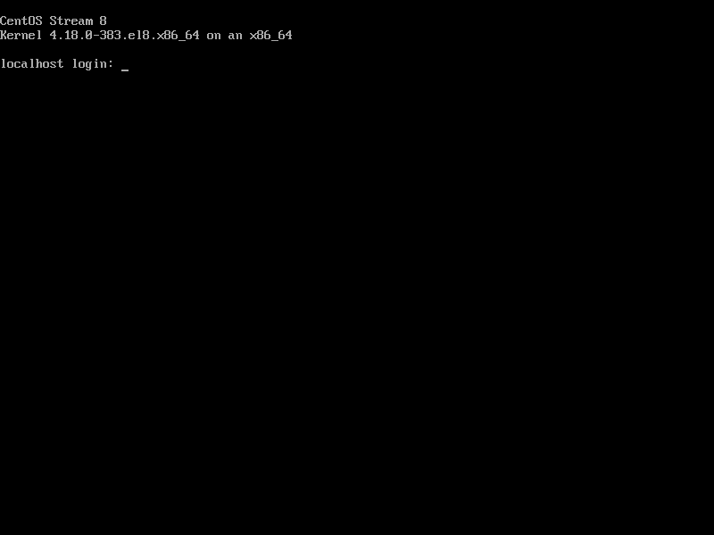

CentOS является дистрибутивом Linux, который имеет повышенную стабильность, высокие скоростные характеристики.

## Загрузка

CentOS Stream 8 является восходящей ветвью Red Hat Enterprise Linux 8.x. CentOS Stream 8 был выпущен 24 сентября 2019 года и будет поддерживаться до конца мая 2024 года.
Загрузить ISO-файл CentOS Stream 8 для установки можно со следующего сайта.

[http://isoredirect.centos.org/centos/8-stream/isos/x86_64/](http://isoredirect.centos.org/centos/8-stream/isos/x86_64/)

## Создание установочного диска

После загрузки образа Centos Stream 8 необходимо его записать на DVD-диск или Flash-накопитель. В моём случае для установки я буду использовать flash-накопитель с интерфейсом USB 3.0 и объемом памяти 16 Гб. Объем памяти выбранного flash-накопителя связан напрямую с объемом самого образа монтируемой операционной системы – он составляет около 10 Гб. Для записи образа можно использовать любую программу, я использую свободно распространяемое программное обеспечение [Rufus](https://rufus.ie/).

В окне программы выбираем устройство на которое будем заливать образ, непосредствеено сам образ. Остальные параметры можно оставить по умолчанию. Ниже представлен процесс записи образа CentOS Stream 8 на flesh-носитель.

## Установка

1. После успешного процесса записи, накопитель вставляется в сервер. После включения компьютера необходимо открыть boot-меню, в котором выбрать с какого устройства выполнить загрузку компьютера. Отобразится следующий приветственный экран на котором необходимо выбрать язык процесса установки. Так же данный язык будет установлен в качестве языка по умолчанию в системе если вы не измените его на следующем шаге.

    

2. После выбора языка, в окне появится меню со сводкой по установочному процессу. Сразу можно заметить пункты с красными надписями. Настройка данных пунктов является обязательной для продолжения установки.

    

3. В пункте Software Selection можно выбрать, какая редакция и пакет программ будут установлены. Выбираем всё необходимое нам, и возвращаемся меню со сводкой.

    

4. Далее выбираем пункт Installation Destination. В данонм пункте выбирается конфигурация хранилища куда будет устанавливаться система. Выбранное физическое или виртуальное хранилище должно соответствовать основным требованиям для установки, а именно - иметь не менее 20 Гб свободного места.

    

5. Следующим шагом в пункте Root Password задаем пароль рута. В свою очередь, пароль должен быть сложным для способов взлома (например, подбор пароля). Другая, не менее важная часть, заключается в том, что при задании пароля нужно обязательно его запомнить или записать, иначе в дальнейшем будет невозможно пользоваться установленной операционной системой.

    

6. Следующий шаг включает в себя выбор часового пояса и формата времени, а также задание времени и даты. Эти настройки не являются конечными – после установки операционной системы их можно изменить.

    

7. Последним шагом в минимальном наборе настроек является создание пользователя, задание его имени и пароля, а также выбор дополнительных настроек, связанных со входом в пользователя и администрированием.

    

8. После завершения основных настроек, можно вернуться в меню и проверить отсутствие каких-либо предупреждающих текстовых надписей.

    

9. После проверки, можно нажать кнопку «Begin Installation». Это запустит установочный процесс, во время которого не нужно предпринимать никаких действий, иначе это негативно скажется на процессе.

    

10. По завершению процесса появится информация об успешном окончании установки и требовании осуществить перезагрузку. Для осуществления этого, нужно нажать кнопку Reboot System.

    

11. Первый запуск может быть немного долгим, поэтому нужно ждать, пока не появится первичное меню выбора операционной системы.

    

12. После успешного запуска появится надпись с названием операционной системы, версией ядра и активным полем для ввода логина системы. После ввода логина будет предложено ввести пароль от соответствующей учетной записи.

    

13. После входа в пользователя появится активная строка с указанием полного имени пользователя, которое выбиралось на одном из этапов установки операционной системы.

    

